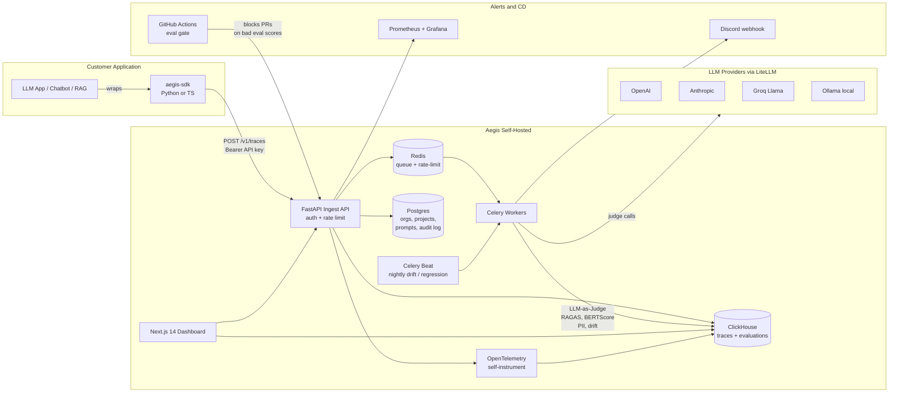

# Aegis — Open-Source LLM Observability & Evaluation Platform

> **Production-grade, self-hostable platform to trace, evaluate, monitor, and safely iterate on LLM applications.**
> Same category as Langfuse, Helicone, and LangSmith — but open-source, K8s-native, and free to run end-to-end.

**Status:** Active development · pre-v0.1 (scaffolding)
**Next ship:** v0.1 — core trace loop (Python SDK → ClickHouse → dashboard) — end of Week 1
**Roadmap:** v0.1 → v0.2 (eval engine) → v0.3 (prompt ops + safety) → v0.4 (cloud-native) → v1.0 — see [§12](#12-roadmap-versioned-shipping)

---

## Table of Contents

1. [The Problem](#1-the-problem)
2. [The Solution](#2-the-solution)
3. [Architecture](#3-architecture)
4. [Tech Stack](#4-tech-stack)
5. [Three-Domain Coverage (AI + FSD + Cloud)](#5-three-domain-coverage)
6. [Core Components in Detail](#6-core-components-in-detail)
7. [Quick Start (₹0 development)](#7-quick-start-0-development)
8. [SDK Usage](#8-sdk-usage)
9. [Real-World Scenario — FinPal Neobank Bot](#9-real-world-scenario--finpal-neobank-bot)
10. [Self-Hosting on Kubernetes](#10-self-hosting-on-kubernetes)
11. [Performance](#11-performance)
12. [Roadmap (Versioned Shipping)](#12-roadmap-versioned-shipping)
13. [What's NOT in Aegis (Anti-Scope)](#13-whats-not-in-aegis-anti-scope)
14. [Industry-Grade Checklist (12-Point Gate)](#14-industry-grade-checklist-12-point-gate)
15. [Project Layout](#15-project-layout)
16. [Contributing](#16-contributing)
17. [License](#17-license)

---

## 1. The Problem

LLM-powered applications **degrade silently in production**. Unlike traditional services, "200 OK with 870 ms latency" tells you nothing about whether the answer was *correct*, *grounded*, or *safe*.

Three failure modes are everywhere:

| Failure | What goes wrong | Who notices first |
|---|---|---|
| **Silent quality drift** | Model upgrade or prompt tweak makes answers subtly worse over weeks | Angry users on social media |
| **Cost bleed** | A bug or new flow 10×s your token spend overnight | Finance, three weeks later |
| **Compliance blind spot** | Bot leaks PII, hallucinates a regulated number, gives unlicensed advice | Regulator, lawsuit, fine |

Datadog and New Relic only see HTTP. They cannot answer:

- Was the answer correct?
- Was it grounded in retrieved context, or hallucinated?
- Are user queries drifting from what we tested?
- Did the new prompt version regress?

Aegis is the missing layer.

---

## 2. The Solution

Aegis sits between an LLM application and the model providers (OpenAI, Anthropic, Groq, Ollama). A team installs it via Helm, drops `aegis-sdk` into their app, and instantly gets:

- **End-to-end tracing** of every LLM call (prompt, completion, tokens, cost, latency, retrieved context, metadata)
- **Automated evaluation** of every response (LLM-as-Judge, RAGAS, BERTScore, PII detection)
- **Prompt versioning + A/B traffic routing** for safe iteration
- **Embedding-based drift detection** to catch out-of-distribution user behaviour
- **Regression detection** that fires alerts when quality drops
- **CI/CD eval gate** that blocks bad prompt deploys before they reach users
- **Multi-tenant isolation** — orgs, projects, RBAC, audit log
- **OpenTelemetry self-instrumentation** — Aegis traces itself in its own dashboard

**Mental model:** *Datadog + GitHub Copilot Eval + Feature Flags, fused for LLM workloads.*

### 2.1 How Aegis differs from Langfuse / Helicone / LangSmith

The category isn't new — Langfuse, Helicone, and LangSmith all do LLM observability. Calling out the real differences honestly:

| Capability | Langfuse | Helicone | LangSmith | **Aegis** |
|---|---|---|---|---|
| Open-source self-host | ✅ (community) | ✅ (community) | ❌ | ✅ (MIT) |
| Multi-provider via single SDK | partial | gateway-only | LangChain-coupled | ✅ (LiteLLM) |
| Prompt registry + A/B routing in core | ✅ | partial | ✅ | ✅ |
| Eval gate that **blocks PRs in CI** | external | external | external | ✅ (built-in) |
| K8s-native — first-class Helm chart | community charts | community charts | hosted-only | ✅ (production primary) |
| Self-hosts on a free tier (₹0 forever) | needs paid tier for prod features | needs paid tier | hosted-only | ✅ (Oracle Cloud Free K3s) |
| Embedding-based prompt drift | partial | ❌ | partial | ✅ |
| 4 stacked evaluators (Judge / RAGAS / BERTScore / PII) | partial | ❌ | partial | ✅ |
| India-flavoured PII detector (PAN, Aadhaar, RuPay) | ❌ | ❌ | ❌ | ✅ |

**Honest framing:** Aegis is *Langfuse-inspired* and overlaps significantly with the OSS feature set. Where it leans different — the K8s-first deploy story, the in-CI eval gate, the free-tier-permanent demo, and the Indian-compliance-flavoured PII detector. Not claiming category creation; claiming a credible self-hostable build with a sharper deploy story.

---

## 3. Architecture



---

## 4. Tech Stack

| Layer | Technology | Why |
|---|---|---|
| **API** | FastAPI (Python 3.11) | Async + Pydantic + auto-OpenAPI |
| **Metadata DB** | Postgres + SQLAlchemy 2.x + Alembic | Orgs, projects, users, API keys, prompt versions, audit log, eval datasets |
| **Trace store** | **ClickHouse** | Columnar, sustains 500+ traces/sec on 2 vCPU; sub-second analytics over billions of rows |
| **Cache + queue** | Redis | Sliding-window rate limiting per tenant + Celery broker |
| **Async workers** | Celery + Celery Beat | Eval jobs, nightly drift, regression detection |
| **LLM gateway** | **LiteLLM** | One client interface for OpenAI / Anthropic / Groq / Ollama — no vendor lock-in |
| **Eval libraries** | RAGAS, BERTScore, sentence-transformers | RAG metrics, semantic similarity, embeddings |
| **Frontend** | **Next.js 14 (App Router)** + Tailwind + shadcn/ui + TanStack Table + Recharts + Monaco diff | Trace explorer, eval explorer, prompt registry diff UI, live SSE stream |
| **Auth** | Supabase Auth (magic link) → JWT | Free-tier auth without rolling your own |
| **SDKs** | `aegis-sdk` (PyPI) + `@aegis/sdk` (npm) | Reliability-first: timeout, retry, in-memory buffer, circuit breaker |
| **Observability (dogfood)** | OpenTelemetry → Prometheus + Grafana | Aegis traces itself in its own dashboard |
| **Local dev** | Docker Compose | One command brings up Postgres + ClickHouse + Redis + API + worker + frontend |
| **Local K8s** | Kind (Kubernetes-in-Docker) | Test the Helm chart on a real cluster, on a laptop |
| **Production deploy** | Helm chart on K8s | `helm install aegis aegis/aegis` on any cluster |
| **Hosted demo** | Oracle Cloud Always Free K3s (4 ARM cores, 24 GB RAM, ₹0/month) | Live demo URL forever-free |
| **Ingress + TLS** | nginx-ingress + cert-manager + Let's Encrypt | Free auto-renewing TLS |
| **Container registry** | GitHub Container Registry (GHCR) | Free for public images |
| **CI/CD** | GitHub Actions | Lint + test + build + push to GHCR + `helm upgrade` |
| **Load test** | k6 | Proves 500 traces/sec @ p99 < 80 ms on 2 vCPU |

---

## 5. Three-Domain Coverage

Aegis is intentionally architected so that **all three engineering domains** are real and substantial:

| Domain | What proves the bar | Where it lives |
|---|---|---|
| **AI/ML (primary)** | Multi-provider gateway `[v0.2]`, 4 evaluators — Judge / RAGAS / BERTScore / PII `[v0.2]`, embedding drift `[v0.3]`, regression detector `[v0.3]`, prompt versioning + A/B routing `[v0.3]` | `backend/app/evaluators/`, `backend/app/services/llm_service.py`, `backend/app/services/prompt_router.py` |
| **FSD (real, secondary)** | Python SDK `[v0.1]`, paste-key dashboard + trace explorer `[v0.1]`, TypeScript SDK `[v0.2]`, magic-link auth + onboarding wizard `[v0.2]`, Monaco diff for prompt versions `[v0.3]`, live SSE trace stream `[v0.3]`, settings + team invite `[v0.4]`, Playwright E2E `[v0.3]` | `frontend/`, `sdk/python/`, `sdk/typescript/`, `frontend/e2e/` |
| **Cloud/DevOps (real, secondary)** | Docker Compose + live single-URL deploy `[v0.1]`, **eval-gated CI** (`cicd/eval_gate.py` blocks PRs on quality regression) `[v0.3]`, raw K8s manifests `[v0.4]`, Helm chart with HPA on API + worker (queue-depth metric) `[v0.4]`, StatefulSets for Postgres / ClickHouse / Redis `[v0.4]`, NetworkPolicy + PDB + RBAC `[v0.4]`, distroless non-root images `[v0.4]`, backup CronJob to MinIO `[v0.4]`, nginx-ingress + cert-manager `[v0.4]`, GH Actions deploy to live K8s `[v0.4]` | `deploy/k8s/`, `deploy/helm/aegis/`, `.github/workflows/`, `cicd/eval_gate.py` |

---

## 6. Core Components in Detail

### 6.1 Ingestion Edge — the SDKs  ·  v0.1 (Python), v0.2 (TypeScript)

The only thing a customer's developer touches:

```python
from aegis_sdk import Aegis
import litellm

aegis = Aegis(api_key="aegis_live_xxx", project="finpal-prod")
aegis.instrument(litellm)   # one line — every LLM call now traced
```

Reliability guarantees:

- 2 s timeout
- 3-retry exponential backoff with **per-event idempotency keys** so SDK retries can never double-count traces
- In-memory ring buffer (10k events)
- Background flush thread
- Circuit breaker — disables Aegis after N consecutive failures so the customer's app **never crashes if Aegis is down**
- **Streaming-aware**: wraps async iterators / SSE generators; trace is finalized on stream completion with full token + cost rollup

### 6.2 Ingestion API  ·  v0.1

`POST /v1/traces` — the only endpoint SDKs talk to. Validates the API key, resolves tenant (`org_id`, `project_id`), enforces sliding-window rate limits, writes to ClickHouse, queues an eval job. Sub-5 ms target.

### 6.3 Storage — Two Stores, One Design  ·  v0.1

| Store | Holds | Why |
|---|---|---|
| **Postgres** | Orgs, projects, users, API keys (hashed), prompts, prompt versions, eval datasets, audit log, RBAC | Relational, transactional, low cardinality |
| **ClickHouse** | Traces, evaluations, drift snapshots | Columnar, billions of rows, p99 < 80 ms on filter queries |

**The interview hook:** *"I started with Postgres for traces, hit ~50 traces/sec because JSONB filtering is row-by-row. Migrated to ClickHouse, partition key `(toYYYYMMDD(ts), project_id)`, got 500/sec on the same 2-vCPU box."*

### 6.4 Async Eval Engine  ·  v0.2

Decoupled from the user request — Celery workers consume eval jobs from Redis.

- **LLM-as-Judge (G-Eval)** — calls a second LLM with a rubric prompt; returns `{accuracy, completeness, safety}` floats 0–1. Each question runs 3× and uses the median to stabilize against judge non-determinism.
- **RAGAS** — only when retrieved context is present; scores `faithfulness`, `answer_relevance`, `context_recall`.
- **BERTScore** — semantic similarity vs. labeled reference; only on traces inside an eval dataset.
- **PII detector** — regex (PAN, Aadhaar, card, email, phone) + tiny LLM check; emits `pii_score` 0–1. Critical for regulated buyers.

### 6.5 Prompt Registry + A/B Traffic Routing  ·  v0.3

Prompts versioned like Git. Each version has full template, model, temperature, stop sequences. SDKs call `aegis.get_prompt("name")` and the server returns a weighted random version based on traffic split (`v2: 90%, v3: 10%`). UI uses **Monaco diff editor** to compare versions side-by-side, with a traffic-split slider for safe rollout.

### 6.6 Drift Detector  ·  v0.3

Nightly Celery Beat job:

1. Pulls last 24 h of prompts
2. Embeds with `sentence-transformers/all-MiniLM-L6-v2` (local CPU, free)
3. Computes centroid, compares to baseline
4. If cosine distance > threshold → emits `drift_score` metric and posts Discord webhook

### 6.7 Regression Detector  ·  v0.3

Compares last 1-hour mean eval score to last 7-day mean. If drop > 2σ, fires alert. Catches "we deployed at 14:00 and broke things" within minutes.

### 6.8 CI/CD Eval Gate  ·  v0.3

Standalone script (`cicd/eval_gate.py`). On every PR that changes a prompt:

1. Loads candidate prompt
2. Runs against fixed eval dataset (50–200 questions)
3. Computes average judge score
4. Exits non-zero if score < threshold → **GitHub Actions blocks the merge**

### 6.9 Trace Share Link  ·  v0.3

Generate a signed, expiring URL (`/s/<token>`) that renders a single trace publicly without auth — for bug reports, Slack threads, customer support. Token has TTL + revoke.

### 6.10 Audit Log  ·  v0.4

Every admin action — prompt promote, API key create/revoke, member invite, role change — written to a `audit_log` Postgres table with actor, target, timestamp, IP. Compliance signal for regulated buyers.

### 6.11 Metrics + Two Dashboards  ·  v0.1 (trace explorer), v0.3 (SSE stream), v0.4 (Grafana)

- **Grafana** for SREs: latency p95/p99, cost burn, ingest rate, drift score, eval score over time. Driven by Prometheus pulling `/metrics`.
- **Next.js trace explorer** for AI engineers: search/filter, click into one trace, see prompt + completion + judge scores side-by-side with `finpal-system` version diff and live SSE stream of incoming traces.

### 6.12 OpenTelemetry Self-Instrumentation  ·  v0.4

Aegis instruments itself with OpenTelemetry — its own traces appear in its own dashboard. The dogfood credibility move.

---

## 7. Quick Start (₹0 development)

Hard constraint: zero spend during weeks 1–3 of build. Every paid choice has a free swap.

### Prerequisites

- Docker + Docker Compose
- Python 3.11+
- Node.js 20+
- (Optional) Kind for local K8s

### 1. Clone

```bash
git clone https://github.com/pottriselvan/aegis.git
cd aegis
```

### 2. Configure environment

```bash
cp .env.example .env
# Edit .env — at minimum set:
#   GROQ_API_KEY=...               (free tier, llama-3.1-70b)
#   POSTGRES_PASSWORD=...
#   CLICKHOUSE_PASSWORD=...
#   AEGIS_JWT_SECRET=...
#   SUPABASE_URL=...               (free tier, for magic-link auth)
#   SUPABASE_ANON_KEY=...
#   SUPABASE_SERVICE_ROLE_KEY=...  (server-side only)
```

### 3. Boot all services

```bash
docker compose up -d
# Brings up: postgres, clickhouse, redis, api, worker, beat, frontend
```

### 4. Run migrations

```bash
docker compose exec api alembic upgrade head
docker compose exec api python -m app.scripts.clickhouse_migrate
```

### 5. Seed demo data (optional)

```bash
docker compose exec api python scripts/seed_demo_data.py
```

### 6. Open the dashboard

```
http://localhost:3000
```

Sign up via magic link → create an org → create a project → copy your API key.

### 7. Send your first trace

```python
pip install aegis-sdk

# In your app:
from aegis_sdk import Aegis
import litellm

aegis = Aegis(api_key="aegis_live_xxx", project="my-bot",
              base_url="http://localhost:8000")
aegis.instrument(litellm)

resp = litellm.completion(
    model="groq/llama-3.1-70b-versatile",
    messages=[{"role": "user", "content": "Hello"}],
)
# Trace, cost, eval score all appear in the dashboard within 5 seconds.
```

---

## 8. SDK Usage

### Python

```python
from aegis_sdk import Aegis
import litellm

aegis = Aegis(api_key="...", project="finpal-prod")
aegis.instrument(litellm)

# Use a versioned prompt with A/B routing
prompt = aegis.get_prompt("finpal-system")
resp = litellm.completion(
    model=prompt.model,
    messages=[{"role": "system", "content": prompt.template},
              {"role": "user", "content": user_question}],
    metadata={"flow": "upi_dispute", "user_tier": "premium"},
)
```

### TypeScript

```typescript
import { Aegis } from "@aegis/sdk";

const aegis = new Aegis({
  apiKey: process.env.AEGIS_KEY!,
  project: "finpal-prod",
});

const prompt = await aegis.getPrompt("finpal-system");
const completion = await aegis.trace(
  { flow: "upi_dispute" },
  () => openai.chat.completions.create({
    model: prompt.model,
    messages: [/* ... */],
  }),
);
```

---

## 9. Real-World Scenario — FinPal Neobank Bot

**FinPal** is an Indian neobank (4 M users) running an AI support bot for balance queries, UPI failures, loan eligibility, fraud alerts. Built on Llama 3.1 70B via Groq + RAG over policy docs. **RBI-regulated** — every customer-facing financial statement is auditable. They install Aegis via Helm and drop `aegis-sdk` into the bot.

### Setup (~15 min)

```python
from aegis_sdk import Aegis
import litellm, os

aegis = Aegis(api_key=os.environ["AEGIS_KEY"],
              project="finpal-support-bot",
              base_url="https://aegis.finpal.internal")
aegis.instrument(litellm)
system_prompt = aegis.get_prompt("finpal-system").template
```

They upload `eval-set.csv` (200 historical questions with reference answers) to Aegis.

### A typical request — Asha asks:

> *"My UPI to Zomato failed yesterday but money was deducted. What do I do?"*

Flow:

1. Bot calls `litellm.completion(model="groq/llama-3.1-70b", ...)`. SDK patch wraps it.
2. RAG retrieves 3 chunks from UPI-dispute policy.
3. LLM responds with proper steps + 7-business-day SLA in 1.1 s.
4. SDK posts trace asynchronously — Asha never waits for Aegis.
5. Within 5 s: LLM-as-Judge scores `accuracy=0.96, completeness=0.91, safety=1.0`; RAGAS scores `faithfulness=0.94, answer_relevance=0.92, context_recall=0.89`; PII detector clean. All in ClickHouse.

### Four real incidents Aegis catches

**① Hallucinated interest rate (Friday-deploy disaster, averted)**
Engineer pushes `finpal-system v3.2` removing the disclaimer line. **CI eval gate** runs the 200-question eval set — accuracy 0.71 vs threshold 0.85 → exit 1, GitHub Actions blocks the merge. Discord alert: *"PR #418 blocked: accuracy 0.92 → 0.71."* **Zero customer impact.**

**② UPI question drift during Diwali**
RuPay-on-UPI questions spike 3×. Drift detector sees prompt-embedding centroid shift +0.34 cosine vs baseline → Discord alert. AI team adds 30 RuPay questions to eval set, finds the bot hallucinates merchant compatibility, fixes RAG ingestion.

**③ Cost spike from a verbose prompt**
Avg tokens/response jumps 180 → 520. Grafana `llm_cost_usd_total` rate alert fires. Investigation: prompt told the bot to "explain reasoning" on every flow. Fix: route balance queries to a concise prompt version. **Cost cut 38% in 24 hours.**

**④ PII leak (the killer compliance feature)**
PII detector flags 14 traces in last hour where the bot echoed the user's full PAN. Discord critical alert. Compliance dashboard shows exposure. RBI audit query:

```sql
SELECT trace_id, user_id, completion
FROM traces
WHERE pii_score > 0.8 AND ts > '2026-05-01'
```

— 200 ms in ClickHouse. Audit log shows which prompt version was live. Engineering ships a guardrail prompt within 2 hours; compliance has a complete incident report in 3 hours instead of 3 weeks.

### Quantified outcome

| Metric | Before Aegis | After Aegis |
|---|---|---|
| Time to detect prompt regression | ~2 weeks (customer complaints) | ~1 minute (CI gate) |
| Bad prompts reaching production | ~1/quarter | 0 (blocked at PR) |
| Cost per conversation | ₹0.42 | ₹0.26 (–38%) |
| Compliance incident response | 3 weeks | 3 hours |
| Engineering time on AI debugging | ~12 hrs/week | ~3 hrs/week |

---

## 10. Self-Hosting on Kubernetes

Aegis is designed to be **K8s-native**. The Helm chart is the production path; raw manifests are in `deploy/k8s/` as a learning/reference artifact.

### What's in the Helm chart

- **Deployments** — API tier and Worker tier, both with HPA
- **HPA** — scales API on CPU; scales Worker on **Celery queue depth** (custom metric) because eval bursts are spiky
- **StatefulSets** — Postgres, ClickHouse, Redis with PersistentVolumeClaims
- **Ingress** — nginx-ingress routing `aegis.<domain>` → frontend, `api.aegis.<domain>` → backend
- **TLS** — cert-manager with Let's Encrypt ClusterIssuer
- **NetworkPolicy** — defense-in-depth for tenant isolation (app layer enforces too)
- **PodDisruptionBudget** — ensures rolling upgrades don't take the API down
- **ServiceAccount + RBAC** — least privilege for the workload itself
- **Pre-install Job** — runs Alembic + ClickHouse migrations before pods start
- **CronJob** — nightly `pg_dump` + ClickHouse `BACKUP TABLE` to MinIO
- **Multi-env values** — `values-dev.yaml` (1 replica, no HPA), `values-prod.yaml` (HPA 2–10, anti-affinity)

### Local install (Kind)

```bash
make cluster                # spins up Kind with registry + ingress
helm install aegis ./deploy/helm/aegis -f deploy/helm/aegis/values-dev.yaml
```

### Production install (any K8s)

```bash
helm repo add aegis https://pottriselvan.github.io/aegis
helm install aegis aegis/aegis -f values-prod.yaml --namespace aegis --create-namespace
```

### Free-tier hosted demo

The live demo at `https://aegis.<your-domain>` runs on **Oracle Cloud Always Free** (4 ARM A1 cores, 24 GB RAM, ₹0/month forever) using K3s. This is the cluster the GitHub Actions deploy job pushes to on every merge to `main`.

---

## 11. Performance

Quotable interview numbers (run on 2 vCPU, 4 GB RAM):

| Metric | Result |
|---|---|
| Trace ingest sustained throughput | **500 traces/sec** |
| Trace ingest p99 latency | **< 80 ms** |
| Trace read query p99 (filtered, last 24 h) | **< 200 ms** |
| Eval job lag (p95) | **< 5 s after ingest** |
| Helm install on fresh Kind cluster | **< 90 s to ready** |

Reproduce:

```bash
k6 run tests/load/k6_ingest.js
```

---

## 12. Roadmap (Versioned Shipping)

Aegis ships in milestone versions, not one mega-release. Each version is a complete, demo-able product on its own. The interview narrative is **"I shipped v0.1 in Week 1 and learned X, which drove the v0.2 design,"** not "I built one big thing."

### Sprint Calendar — 2026-05-11 to 2026-07-31

12 calendar weeks (11 full + 5-day tail). Concrete ship dates, not "Week N":

| Wk | Dates | Focus | Ship target |
|----|-------|-------|-------------|
| 1 | May 11–17 | Week 0 ramp + DSA Hashing | — |
| 2 | May 18–24 | Aegis v0.1 build | — |
| **3** | **May 25–31** | Aegis v0.1 polish + deploy | **Aegis v0.1 SHIP — Sun May 31** |
| 4 | Jun 1–7 | Aegis v0.2 build (eval engine + multi-provider) | — |
| **5** | **Jun 8–14** | Aegis v0.2 polish + deploy | **Aegis v0.2 SHIP — Sun Jun 14** |
| 6 | Jun 15–21 | Aegis v0.3 build (prompt registry + drift + CI gate) | — |
| **7** | **Jun 22–28** | Aegis v0.3 polish + deploy | **Aegis v0.3 SHIP — Sun Jun 28 (12/12 portfolio gate)** |
| 8 | Jun 29 – Jul 5 | Lattice v0.1 build | — |
| 9 | Jul 6–12 | Lattice v0.1 ship + v0.2 build | Lattice v0.1 |
| 10 | Jul 13–19 | Lattice v0.2 ship + v0.3 build | Lattice v0.2 |
| 11 | Jul 20–26 | Lattice v0.3 ship + Helix v0.1 build | Lattice v0.3 |
| **12** | **Jul 27–31** | Helix v0.1 ship + announcement | **Helix v0.1 SHIP** |

**Daily DSA:** 1 LeetCode medium each morning (6-7 AM). **Sunday meta-pipeline** (LinkedIn / mocks / applications): 2 hr. **Floor commitment:** Aegis v0.1 by May 31 is non-negotiable; below that, rescue v0.1 and cut v0.2 scope.

### Week 0 — Foundational ramp (~22 hrs, no shipped code yet)

Pre-build learning to de-risk the cold-start tax on AI/ML and Cloud. **Hard rule:** every block ends with a *working artifact*, not just notes. If a topic doesn't end in code that runs, it didn't happen. Order matters — later blocks assume earlier ones.

| # | Hrs | Topic | Done = (artifact) |
|---|---|---|---|
| 1 | 1 | OpenAI + Anthropic SDK basics — tokens, pricing, streaming, function calling | `python hello_llm.py` prints a streamed reply, token count, and computed cost |
| 2 | 4 | LiteLLM unified gateway across providers | One script calls OpenAI + Groq (free tier) + Anthropic + Ollama (local) via `litellm.completion()` |
| 3 | 3 | OpenAI SDK monkey-patch / instrumentation pattern | `instrument_openai()` decorator captures prompt + response + cost on every call without changing call sites |
| 4 | 3 | ClickHouse `MergeTree` — partitioning, ordering, indexes, `clickhouse-client` ergonomics | Local ClickHouse container; insert 100 k synthetic spans; analytic `SELECT … GROUP BY` returns in < 100 ms |
| 5 | 3 | `sentence-transformers/all-MiniLM-L6-v2` + cosine drift math | Python script computes embedding centroid for 100 prompts and measures cosine drift vs a second batch |
| 6 | 1.5 | Next.js 14 App Router + shadcn/ui refresher | `npx create-next-app`, add 3 shadcn components (Card, Table, Button), one Server Action working |
| 7 | 6.5 | Kind cluster + raw K8s manifests + minimal Helm chart | `kind create cluster` running a hello-FastAPI Deployment + Service + Ingress, then re-deployed via a 5-template Helm chart |

**Total: ~22 hrs.** Skip blocks at your own risk — the cold-start tax compounds. Skipping block 4 (ClickHouse) burns 4 hrs of v0.1 build time on schema design instead of 1; skipping block 7 blocks v0.4 entirely.

---

### v0.1 — Core trace loop · Ships end of Week 1 · ~40 hrs

**Promise:** *Drop 2 lines into your Python app, see every OpenAI call show up in a dashboard within 5 seconds.*

**In scope:**
- Python SDK — auto-instruments OpenAI client (idempotency keys, retries, circuit breaker, streaming-aware)
- FastAPI ingest API (`POST /v1/traces`) — single API-key auth
- ClickHouse traces store — date-partitioned, indexed
- Postgres metadata — orgs, projects, api_keys (one demo tenant seeded; no signup yet)
- Next.js dashboard — paste-key login, trace list, trace detail (prompt / response / tokens / cost / latency)
- Docker Compose — one command boots the full stack
- Live deploy — single URL on Railway / Fly.io / Hetzner ($0–5/month)
- README quickstart, 60-sec Loom demo, MIT license, 1 ADR (ClickHouse choice)

**Explicit non-goals:** TypeScript SDK · multi-provider gateway · evals · magic-link auth · prompt registry · Helm · drift · audit log

---

### v0.2 — Eval engine + multi-provider · Ships end of Week 2 · ~35 hrs

**Promise:** *Every traced response gets scored automatically — accuracy, faithfulness, PII safety — within 5 seconds.*

**In scope:**
- LiteLLM gateway — adds Anthropic, Groq (free tier), Ollama (local) alongside OpenAI
- TypeScript SDK on npm — feature parity with Python SDK
- Celery + Celery Beat workers
- LLM-as-Judge (G-Eval) evaluator with median-of-3 stabilization
- RAGAS evaluator (when retrieved context present)
- BERTScore evaluator (against labeled reference)
- PII detector — regex (PAN, Aadhaar, card, email, phone) + tiny LLM check
- Magic-link auth via Supabase
- Multi-tenant onboarding wizard (org → project → API key)
- Eval datasets + eval runs (Postgres-backed, browseable in dashboard)

**Explicit non-goals:** prompt registry · A/B routing · drift · regression · CI gate · Helm

---

### v0.3 — Prompt ops + safety · Ships end of Week 3 · ~35 hrs

**Promise:** *Iterate on prompts safely — version them like Git, A/B test traffic, block bad ones in CI, catch silent regressions in production.*

**In scope:**
- Prompt registry — versioned prompts with model, temperature, stop sequences
- Monaco diff editor for side-by-side version comparison
- A/B traffic routing with weighted random selection (`v2: 90%, v3: 10%`)
- Embedding-based drift detector (nightly Celery Beat job)
- Regression detector (1h vs 7d eval-score comparison, ±2σ threshold)
- CI/CD eval gate (`cicd/eval_gate.py`) — blocks PRs on quality regression
- Live SSE stream of incoming traces
- Trace share link (signed expiring URL, no auth)
- Discord webhook alerts
- Playwright E2E tests, pytest unit suite, Bruno API collection
- k6 load test proving 500 traces/sec @ p99 < 80 ms

**v0.3 is the portfolio-grade ship date.** All 12 industry-grade checklist items clear here. This is the version you put on your resume.

**Explicit non-goals:** Helm chart · OTel self-instrumentation · multi-tenant RBAC · audit log

---

### v0.4 — Cloud-native · Optional / post-portfolio · ~30 hrs

**Promise:** *`helm install aegis aegis/aegis` deploys the entire stack to any K8s cluster.*

**In scope:**
- Raw K8s manifests in `deploy/k8s/` (learning artifact — keep them)
- Kind cluster config + Makefile for local K8s testing
- Helm chart with HPA (CPU on API, queue-depth on Worker), StatefulSets, PDB, NetworkPolicy, RBAC
- Multi-env values files (`values-dev.yaml`, `values-prod.yaml`)
- Distroless non-root container images
- Backup CronJob — `pg_dump` + ClickHouse `BACKUP TABLE` to MinIO
- nginx-ingress + cert-manager + Let's Encrypt TLS
- GitHub Actions deploy job to Oracle Cloud Always Free K3s
- Multi-tenant RBAC (owner / admin / member roles)
- Audit log for admin actions (Postgres `audit_log` table)
- OpenTelemetry self-instrumentation — Aegis traces itself in its own dashboard
- Grafana dashboards for SREs

> **v0.4 ships only if Aegis is your primary Cloud/DevOps domain proof.** If Helix takes that role, v0.4 becomes a nice-to-have rather than a portfolio gate.

---

### v1.0 — Stable release

No new features. Polish + announcement only. Bump major version, tag release, write the launch blog post / X thread, submit to Hacker News, post in r/LocalLLaMA and r/MachineLearning.

---

### Post-v1.0 future roadmap

- Cost-aware sampling — eval the 10 % of traces most likely to be bad, not random
- Multi-model A/B testing dashboard
- Fine-tuning feedback loop — promote high-rated traces into a curated dataset
- Distributed tracing integration (link Aegis traces to OTel traces in customer's app)
- Statistical significance testing on prompt A/B comparisons
- Semantic cache (skip LLM call when a near-identical prompt was answered well recently)

---

### Why versioned shipping (vs. a 3-week mega-release)

| Mega-ship (one big release) | Versioned ladder (v0.1 → v0.4) |
|---|---|
| One ship date — if life happens, nothing exists | Three ship dates — even v0.1 is portfolio-grade alone |
| One demo video covering everything → "and here's also…" sprawl | Three focused demos, each with a clear promise |
| "I built X" interview story | "I shipped v0.1, learned Y, designed v0.2 around it" — a senior signal |
| Hard to gather user feedback | Real users can try v0.1 while you build v0.2 — actual stars and issues |
| Slipped Helm in Week 3 = README claims K8s but repo has Compose only | v0.1 honestly ships Compose; Helm arrives in v0.4 when it's real |

---

## 13. What's NOT in Aegis (Anti-Scope)

Per-version non-goals are listed in §12. The list below is **permanent** — features Aegis will not build, ever, regardless of version. Listing this is a senior-engineer move: scoping discipline reads as confidence, not weakness.

- **No fine-tuning workflow.** Aegis observes inference traffic; it does not orchestrate model training. That belongs in MLflow / Weights & Biases.
- **No human-in-the-loop annotation UI.** Eval is automated (Judge / RAGAS / PII). If you need humans rating thousands of traces, use Argilla or Label Studio downstream of an Aegis trace export.
- **No SOC 2 / HIPAA evidence collection.** Aegis exposes the audit log and PII detector that *help* a compliance program; it is not the compliance program. We will not chase a SOC 2 Type II report — it's a $50k+ effort orthogonal to the engineering goal.
- **No on-prem air-gapped install.** Self-host on K8s is supported; air-gapped (no internet from the cluster, signed binaries, supply-chain attestation) is an enterprise-distribution problem, not a v1 problem.
- **No Bedrock / Vertex / Azure-OpenAI providers in v1.** LiteLLM technically supports them; we will not test, document, or support them until a real user asks. Premature support = bug surface without users.
- **No SSO / SAML / SCIM.** Magic-link auth is the v0.2+ ceiling. Enterprise SSO is a 2-week build that pays off only with paying customers — pre-customer it's polish theatre.
- **No native mobile app.** Dashboard is responsive web; that's enough.
- **No real-time collaborative trace annotation (Yjs / CRDTs).** Lattice has CRDTs as its hard problem — Aegis stays read-mostly.
- **No alert routing engine (PagerDuty / Opsgenie integrations).** Discord webhook is the v0.3 ceiling. Use a real alerting tool downstream of `/metrics`.

**Why this list matters:** every line above is a "yes, but…" feature an interviewer or contributor will suggest. Having a documented "no" with a one-line reason turns the conversation from *"why didn't you build X?"* to *"oh, you've already thought about X — let's talk about what you did build."*

---

## 14. Industry-Grade Checklist (12-Point Gate)

Every project in the portfolio must clear 12 items before being called "shipped." This list is the gate between *"candidate has GitHub repos"* and *"candidate has shipped products."* For Aegis, all 12 clear at **v0.3** (end of Week 3 — the portfolio-grade ship).

| # | Item | Where in Aegis | Lands in |
|---|---|---|---|
| 1 | Live deployed URL with seed data | Railway / Fly v0.1 → Oracle K3s v0.4 | v0.1 |
| 2 | Polished README — hero GIF, architecture diagram, quickstart, roadmap | This file | v0.1 (seed) → v0.3 (final) |
| 3 | Architecture diagram in repo | §3 Mermaid (also `docs/architecture.excalidraw`) | v0.1 |
| 4 | 60-second demo video (Loom / unlisted YouTube), linked at top of README | Per-version demos: v0.1 trace loop · v0.2 evals · v0.3 prompt ops | v0.1 → v0.3 |
| 5 | Tests — unit on core logic + ≥ 1 E2E happy path | `backend/tests/unit/` (pytest) + `frontend/e2e/` (Playwright) | v0.3 |
| 6 | CI/CD — GitHub Actions: lint + test + build + deploy on merge to `main` | `.github/workflows/ci.yml`, `deploy.yml` | v0.3 |
| 7 | Observability — structured logs + metrics endpoint + traces | `backend/app/metrics/` Prometheus exporter; OTel self-instrument in v0.4 | v0.3 (metrics) → v0.4 (OTel) |
| 8 | Threat model in `SECURITY.md` — trust boundaries documented | Auth boundary, tenant isolation, PII handling, key rotation | v0.3 |
| 9 | Performance number quotable in interview | `tests/load/k6_ingest.js` proving 500 traces/sec @ p99 < 80 ms | v0.3 |
| 10 | At least one ADR explaining a non-obvious choice | `docs/adr/0001-clickhouse-over-postgres.md` (v0.1) + `0002-litellm-vs-direct-providers.md` (v0.2) + `0003-rls-vs-schema-per-tenant.md` (v0.3) | v0.1 → v0.3 |
| 11 | Open-source license + clean commit history (no `wip` / `fix` sludge) | MIT `LICENSE`; squash-merge per branch | every version |
| 12 | Issue templates + PR templates | `.github/ISSUE_TEMPLATE/` + `PULL_REQUEST_TEMPLATE.md` | v0.1 |

**Escape valve:** the demo video can land within 7 days of public deploy — but everything else must be in place before announcing or sharing. Treat the checklist as a gate, not a wishlist. **Do not start the next portfolio project (Lattice) until Aegis is 12/12.**

---

## 15. Project Layout

```
aegis/
├── backend/
│   ├── app/
│   │   ├── api/routes/          # REST endpoints (traces, prompts, evals, share, stream)
│   │   ├── auth/                # API keys, sessions, rate limit, RBAC
│   │   ├── db/
│   │   │   ├── models/          # Postgres SQLAlchemy models + audit log
│   │   │   └── clickhouse.py    # ClickHouse client wrapper
│   │   ├── evaluators/          # llm_judge, ragas_eval, bertscore, pii, drift, regression
│   │   ├── services/            # llm_service (LiteLLM), cost, prompt_router, eval_runs
│   │   ├── workers/             # Celery app + tasks
│   │   ├── metrics/             # Prometheus exporter
│   │   ├── alerts/              # Discord/Slack webhook
│   │   └── middleware/          # audit log, OTel
│   ├── alembic/                 # Postgres migrations
│   └── tests/
│       ├── unit/                # pytest unit suite
│       └── integration/
├── frontend/
│   ├── app/
│   │   ├── (auth)/              # signup + magic-link login + onboarding wizard
│   │   ├── traces/              # explorer + live SSE stream
│   │   ├── evaluations/         # eval explorer, dataset CRUD
│   │   ├── prompts/             # registry with Monaco diff
│   │   ├── settings/            # team, RBAC, API keys
│   │   └── s/[token]/           # public trace share link
│   └── e2e/                     # Playwright E2E tests
├── sdk/
│   ├── python/                  # aegis-sdk on PyPI
│   └── typescript/              # @aegis/sdk on npm
├── infra/
│   ├── docker-compose.yml
│   ├── clickhouse/
│   │   ├── init.sql
│   │   └── migrations/
│   └── grafana/dashboards/
├── deploy/
│   ├── k8s/                     # raw K8s manifests (learning artifact)
│   ├── kind/                    # Kind cluster config + Makefile
│   └── helm/aegis/              # production Helm chart
├── cicd/
│   └── eval_gate.py             # CI quality gate
├── tests/load/k6_ingest.js
├── scripts/seed_demo_data.py
├── docs/
│   ├── adr/                     # Architecture Decision Records
│   ├── api/aegis.bruno/         # Bruno API collection
│   └── runbooks/backup-restore.md
├── .github/
│   ├── workflows/               # ci.yml, deploy.yml
│   ├── ISSUE_TEMPLATE/
│   └── PULL_REQUEST_TEMPLATE.md
├── README.md                    # this file
├── CONTRIBUTING.md
├── SECURITY.md                  # threat model
├── PRIVACY.md
└── LICENSE                      # MIT
```

---

## 16. Contributing

See [CONTRIBUTING.md](CONTRIBUTING.md) for dev environment setup, branching strategy, commit message style, and code-of-conduct.

For security disclosures, see [SECURITY.md](SECURITY.md).

For data handling on the public demo, see [PRIVACY.md](PRIVACY.md).

---

## 17. License

MIT — see [LICENSE](LICENSE).

---

**Author:** Pottri Selvan R
**Status:** Active development (Weeks 1–3 of 8-week portfolio sprint)
**Live demo:** *(coming end of Week 3 — Oracle Cloud Always Free K3s)*
